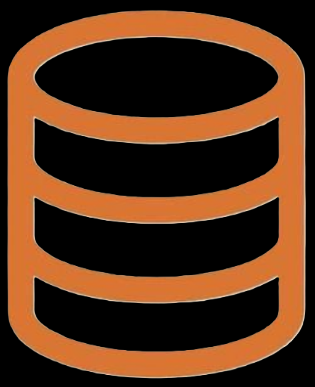

## Hi there 👋

### 👩‍💻 About Me
I am a Computer Science and Engineering student with a solid foundation in Data Structures and Algorithms using C++. I also have experience in Web Development, focusing on Front-End technologies like React.js, Redux.js, and JavaScript. I am curious, eager to learn, and motivated to contribute to impactful projects in the IT industry.

- 🔭 Currently working on Web development projects
- 🌱 Learning React and Redux

#### 🛠 Language and tools
 
 

  
 
   
  

  
##### ✉️ How can you contact me?

&nbsp;

